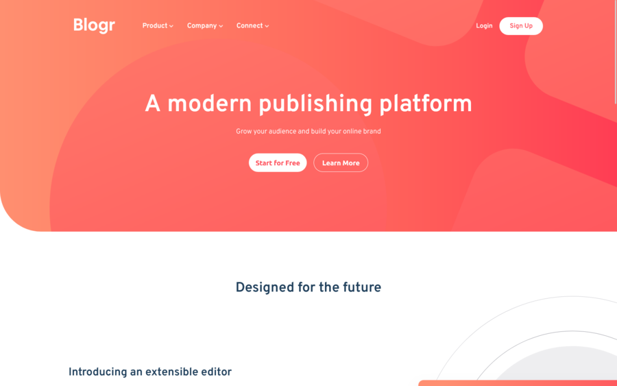

# Frontend Mentor - Blogr landing page solution

This is a solution to the [Blogr landing page challenge on Frontend Mentor](https://www.frontendmentor.io/challenges/blogr-landing-page-EX2RLAApP). Frontend Mentor challenges help you improve your coding skills by building realistic projects.

## Table of contents

- [Overview](#overview)
  - [The challenge](#the-challenge)
  - [Screenshot](#screenshot)
  - [Links](#links)
- [My process](#my-process)
  - [Built with](#built-with)
  - [What I learned](#what-i-learned)
- [Author](#author)

## Overview

### The challenge

### Screenshot

### Links

- Solution URL: [Add solution URL here](https://your-solution-url.com)
- Live Site URL: [https://p4bloxx.github.io/Blogr-landing-page/]

## My process

### Built with

- Semantic HTML5 markup
- CSS custom properties
- Flexbox
- Javascript Vanilla

### What I learnedù

Hi everyone, in this challenge I tried to implement the layout to be implemented as best as possible, finding some difficulties in the Javascript code to make the dropdown menu work better together with the other elements such as arrows. Overall it was great exercise.

Cheers

## Author

- Frontend Mentor - [@p4bloxx](https://www.frontendmentor.io/profile/p4bloxx)
